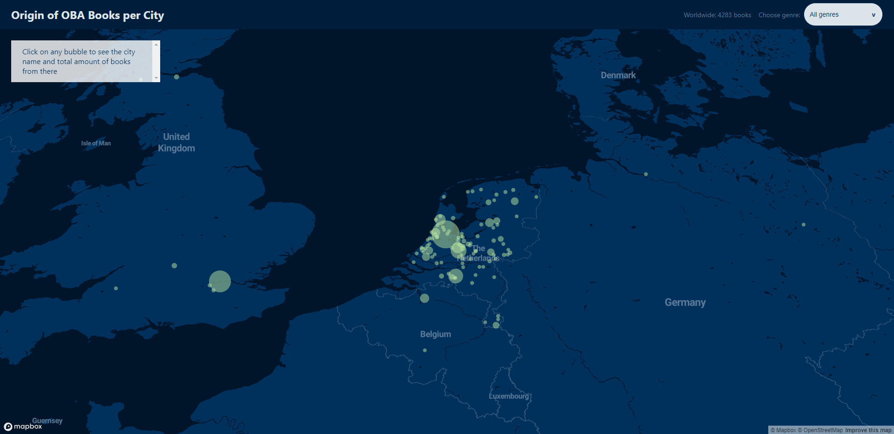
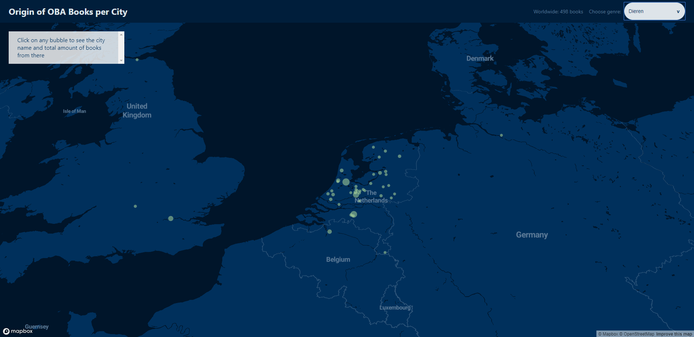
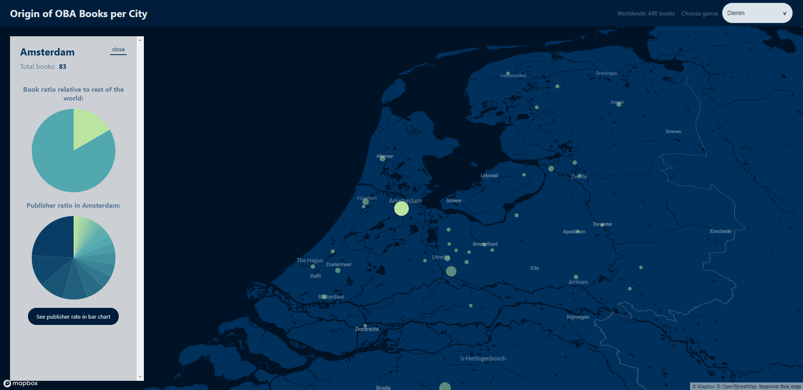
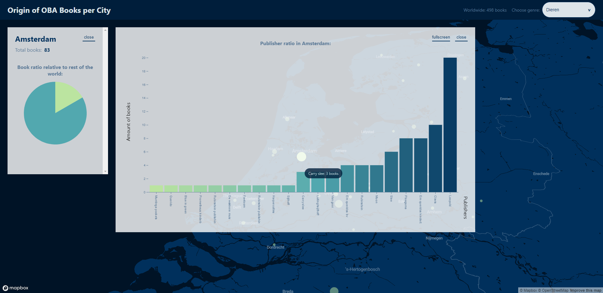
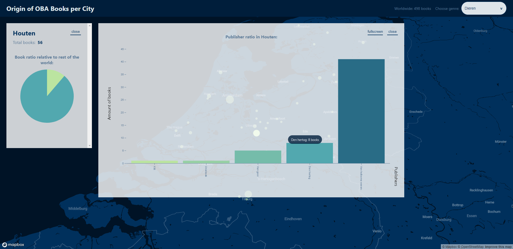
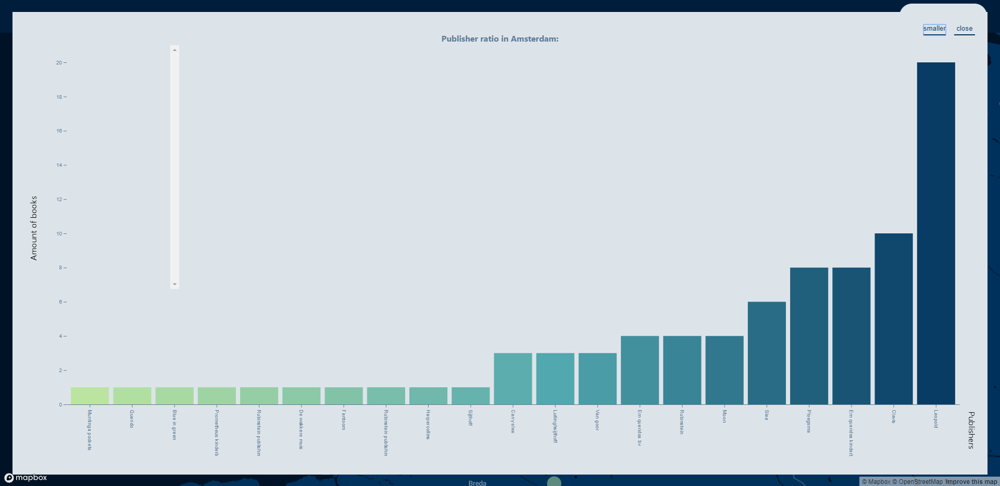
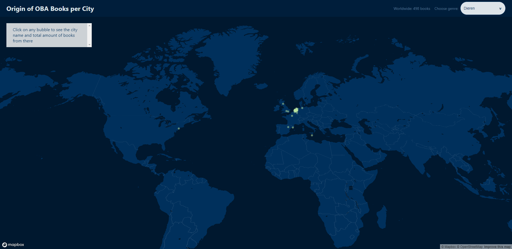
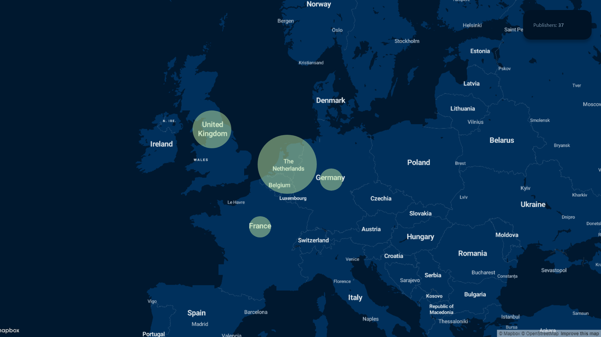
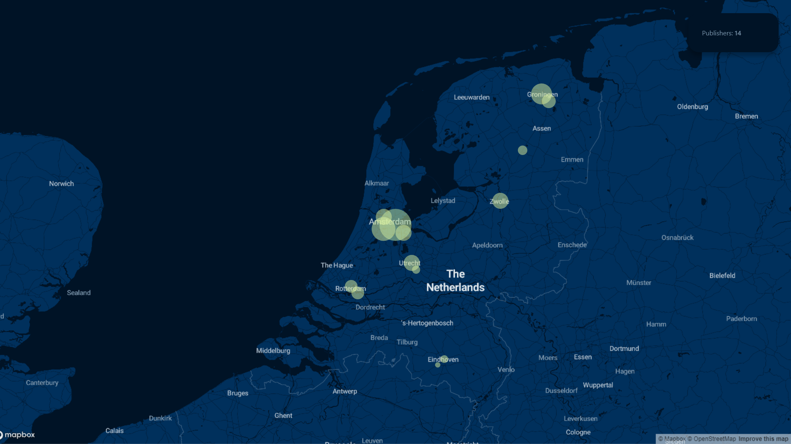
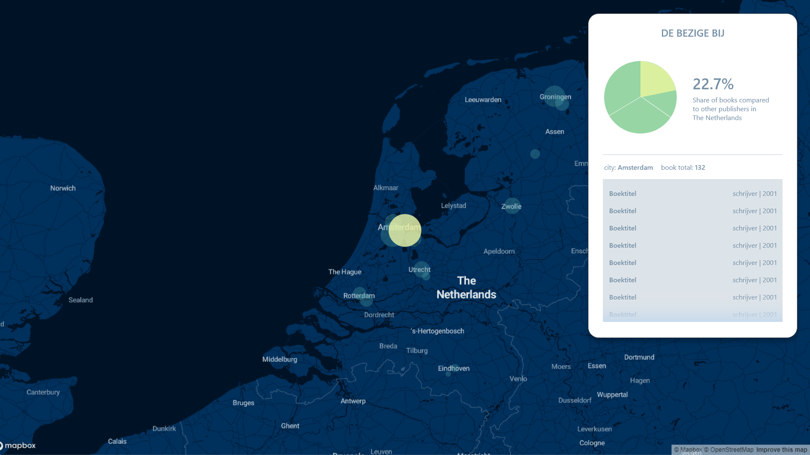

# Frontend data

## Summary
To make a interactive multi level datavisualisation using D3.js about entries from the OBA API.

[see the prototype](https://fjvdpol.github.io/frontend-data/static)

## Table of contents

- [Install](#install)
- [Data](#data)
- [Prototype](#prototype)
- [Code](#code)
- [Conclusion](#conclusion)
- [Still to do](#to-do)
- [Credits](#credits)
- [Proces](#proces)

## Install
```bash
# clone the repo
git clone https://fjvdpol.github.com/frontend-data

# Create a .env file
touch .env

# Add public key to the .env file (obv you need to get your hands on your own public key)
echo "PUBLIC=0123456789" >> .env

# Install dependencies
npm install

# Bundle the javascript modules
npm run build

# run static server (to prevent JSON crying about CORS)
http-server static
```

## Data
The data used in this process consists of a selection of ~4200 books from the OBA in a JSON file, kindly made available by [maanlamp](https://github.com/maanlamp).
Inside this project is a way to get your own set of data, but i would not recommend it since it will output in a format that can't be used by the current visualisation (it's on my to-do list...)
If you do want to generate a custom data file, just run
`node server`
in the root folder of the project.
I've chosen to use maanlamp's selection since it provided a nice big dataset with alot of different types of books.

## Prototype
[check the live prototype here](https://fjvdpol.github.io/frontend-data/static)

When loading up the prototype the first state you will encounter is a map, with the Netherlands in the center.



---
You can switch to a specific genre (or back to all books) in the top right corner of the screen.



---
When clicking on any points of the map, data will be shown about that specific city.



---
Hovering over items of the pie charts will show a tooltip with info about that specific data item.


---
Clicking on the button in the lower left corner of the screen will switch to a bar chart view instead of a second pie chart.



---
While in this view and clicking on another point on the map, the data will update to show the newly clicked city



---
Clicking on the fullscreen button will render the bar chart almost full screen, so when there are a lot of bars to be shown you can see the individual ones better.



---
You can also zoom out and explore where books of the OBA come from from all over te world!



## Process
After the [previous project](https://github.com/fjvdpol/functional-programming), I had to find a new interesting way to sort the entries from the OBA API.
I've always been the most impressed by datavisualisations using maps, so I decided to use the publication location of books as my entry point.

I started with setting up this project by adding eslint and xo, because I never really worked with linters or bug-prevention scripts.

After that it was time to haul over the server and API I used in the previous project.

I want to show the total amount of books per country from all the books within a genre from the OBA API, so I started looking for a way to generate a map which was able to give me plenty of scaling options. I ended up with [mapbox](https://www.mapbox.com/), after that website was shown to me by Bert Spaan in a lecture. I customized a style for the map and loaded it into this project.

I rewrote my index.js to add Place, Publisher and Author to the book data so I will be able to plot the locations on the mapbox map.

After a bit of brainstorming and talking to laurens I settled on making a datavisualisation which first plots the countries where books are published. Once clicked on a country the locations of publishers are plotted on the country map. Every publisher dot will be bigger or smaller depending on the amount of books they published that are present in the OBA stock. Clicking on a publisher will show metadata about the publisher and compare the publisher in a pie chart to the rest of the publishers in that country.
Clicking on any slice of the pie chart will move the focus to that specific publisher.

### Process: High fidelity prototype
*(these are wireframes, not the final product)*  

To further envision this concept I made a few wireframes. I intend the project to start as a relatively bare world map, where you can see where the books that are in the OBA API come from. The bigger the circle on a country, the more books/publishers (still deciding) come from that country.



---
If you click on any of the circles the map will zoom in on that specific country (you can also zoom manually). Zooming in will show more circles in specific places in that country. Every circle in a country represents a publisher in that country. The bigger the circle, the more books come from that publisher.



---
Clicking on any of the publishers will open a detail tab, which shows information about this specific publisher and shows the amount of books they provide to the OBA relative to the other publishers in that country in a pie chart. Clicking on other pieces of the pie chart will shift the focus to that represented publisher.
A list of all books from the specific publisher will also be shown.
If I have enough time I'd like to add charts that show the ratio of languages and/or genres they provide.



---
### Process: Final concept
After presenteing my wireframes to my peers where the idea arose to cluster the publishers per city, to show one dot per city instead of one per publisher. When clicking on one of the city dots two pie charts show up. The first chart shows the ratio of the total books of that city in relation to the rest of the world and the next one shows the ratio of publishers in relation to eachother in that city.

In the end I also decided to add a bar chart for the ratio between publishers in a specific city, which sometimes helps to better show the absolute values relative to eachoter.

I left the original pie chart showing the relation between publishers in the product because it works better than a bar chart for mobile users.

### Process: Code Journey
I started out with a project that didn't need any compiling. I wrote all the functionality in one or two JS files and included dependencies like d3 inline in ```static/index.html```.   
I was looking for a way to easliy render a map on a website, and [tim](https://github.com/timruiterkamp/) recommended me to try out [mapbox](https://mapbox.com).   
It was really easy to set up and within an hour I had a live world map on my screen.

I searched around for ways to combine d3 for connecting data with dom elements and mapbox for the background map. I soon found some [examples](https://github.com/jorditost/mapboxgl-d3-playground) by [jorditost](https://github.com/jorditost).

Once I got my hands on some city coordinates via [simplemaps](https://simplemaps.com/data/world-cities) and [bobdenotter](https://github.com/bobdenotter/4pp) I had datapoints on my map within no-time.   
The CSV files didn't give me coordinates for all the cities I wanted though, so I tried to use a bigger datafile like [the one by google](https://developers.google.com/public-data/docs/canonical/countries_csv), but it took waaaaay to long to parse the csv and combine the coordinates to my own data, so I decided to keep using the lesser complete dataset.

When it was time to show dynamic information on the screen based on what map point you focused on, I decided to quickly add Vue to easily render information changes.

It was quite simple to single out the data I needed per city. With the data I wanted to draw pie charts showing the ratio of values of that city compared to other cities or of publishers within.
With the awesome examples of d3 pie charts from [Mike Bostock](https://bl.ocks.org/mbostock/1346410) and [Chuck Grimett](http://www.cagrimmett.com/til/2016/08/19/d3-pie-chart.html) I had a pie chart running in no time.   
A challenge hereby was that I wanted to show two pie charts per city, without duplicating the pie chart draw function of course. I decided to pass an ID and data to be rendered as props in vue, which in turn returned a div with the passed ID. The pie.draw( *id*,*data* ) function uses this ID to select that specific div and voila, you can make unlimited pie charts by adding new pie-chart components.

Another challenge was to correctly sort the data so the pie charts would show the publishers within a city, sorted by the amount of books they provide relative to the total.   
I tried sorting at various different point in my scripts where data gets changed or formatted, and for some reason I kept getting component loop warnings or really really slow results. In the end the sort function ended up where I pass the city data to the vue component which renders all information for a city, which for some reason didn't give me slow results.

The last day of the project [wooorm](https://github.com/wooorm) hinted me that a pie chart is a "useless" chart, which I guess meant that it doesn't really show insights very well.   
Based on this remark I decided to add the option to show the ratio of publishers as a bar chart instead of a pie chart.   
This was really annoying to implement on mobile, so I decided to only render the pie chart on mobile instead.   
The bar chart still was hard to read for some cities with a lot of publishers, so I decided to add a fullscreen option.

Around this time my code had become such a hard document to read, that I decided that it was time to split it up in modules (which I should've done way earlier, in hindsight).
It was the first time for me to setup build and watch scripts myself, since I've only had experience with complete development packages before.
I installed and configured [browserify]('https://github.com/browserify/browserify'). After that I split my javascript file into small modules within a `src` folder.
It didn't work properly, and [wooorm](https://github.com/wooorm) pointed out that I needed a single entry file to perform browserify on, instead of trying to browserify the complete src folder.   
After browserify was working properly I added babelify to make sure my prototype works in most browsers.

## To-do
* [ ] Small design tweaks to fix small visual errors and overflows
* [ ] Show somewhere how many books where not located because their city is not in the `data/*.csv` files
* [ ] Adding uglify-js to minify my `static/bundle.js`
* [ ] Possibly adding [LocationIQ API](https://locationiq.com/) for looking up coordinates, instead of using static csv files
